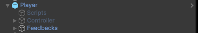

# Introduzione al Framework DemG

Perché usare questo framework?
Vantaggi/Svantaggi

Questo framework è stato disegnato per :

- Avere un workflow di sviluppo unico per tutti i videogiochi
- Avere una struttura di componenti, entità e template organizzata e riutilizzabile
- Poter mentalmente separare i sistemi di gioco, dalle logiche
- E' mirato per i developer che sviluppano codice a mano e non con blueprint
- Ottimizzare le prestazioni di gioco, avere un codice scalabile, configurabile, riutilizzabile e pulito da leggere/scrivere
- La possibilità di creare delle configurazioni per ogni entità che possono essere iniettate (es: enemyManager.state.InjectState("Poisoned"))

Un framework con queste capacità è un ottima risorsa per ogni business di questo genere, perché permette di creare giochi e nel frattempo crearne tanti altri poiché le stesse meccaniche possono essere riutilizzate e configurate in modo diverso.
E' ottimo per un game dev perché ha sempre un modo pre-stabilito ed efficente di creare qualunque entità di gioco e contestualizzarla alla modalità di gioco/livello che si sta svolgendo.

Nota per il futuro: Sarà a breve implementato l'aggiornamento che permette lo sviluppo per giochi multigiocatore online e offline (split-screen).

# Come funziona il Framework?

Questo framework ha differenti aspetti, il primo e nonchè fondamentale è il sistema di entità.
Ogni entità è costuita in questo modo:



All'interno dell'oggetto "Scripts" abbiamo tutti i componenti (meccaniche) di una determinata entità di gioco (Giocatore principale, NPC, nemico, etc..)

Nell'oggetto Root (in questo caso "Player") troviamo un BaseEntityManager (che dev'essere wrappato in uno script custom PlayerManager : BaseEntityManager<State, Property>)

```
public class BaseEntityManager<TState, TProperty> : MonoBehaviour
{
    [TabGroup("Base State")]
    public TState state;

    [TabGroup("Components")]
    public TProperty properties;

    public virtual void Awake() {
        (state as BaseEntityState).Initialize<TProperty>(properties);
    }
}
```

Lo State è sempre wrappato in uno script custom PlayerState : BaseEntityState.

```
public class BaseEntityState
{
    [TabGroup("Components")]
    public GameObject scripts;
    [TabGroup("Components")]
    public Components components = new Components();

    protected Dictionary<string, Action<dynamic>> stateInjections = new Dictionary<string, Action<dynamic>>();
    
    public virtual void Initialize<TProperty>(TProperty properties) {
        components.InitializeComponents(scripts);
        DefaultSetup<TProperty>(properties);
    }
    public virtual void DefaultSetup<TProperty>(TProperty properties) {
        components.DefaultSetup<TProperty>(properties);
    }
    public void SetNewConfigurationFor<TProperty>(string type, TProperty data) {
        components.ReinitializeDataOfComponent<TProperty>(type, data);
    }
    public void ResetConfigurationAtDefaultFor<TProperty>(string type, TProperty properties) {
        components.ReinitializeDataOfComponent<TProperty>(type, properties);
    }

    public void AddNewInjection(string stateName, Action<dynamic> stateInjection) {
        if(stateInjections.ContainsKey(stateName)) {
            return;
        }   
        stateInjections.Add(stateName, stateInjection);
    }
    public void RemoveInjection(string stateName) {
        if (stateInjections.ContainsKey(stateName)) {
            stateInjections.Remove(stateName);
        }
    }
    public void InjectState(string stateName, dynamic parameters) {
        if (stateInjections.ContainsKey(stateName)) {
            stateInjections[stateName].DynamicInvoke(parameters);
        }
    }
}
```

Lo State poi gestisce tutti i componenti (BaseEntityComponent, es: Movement: BaseEntityComponent).
Il manager carica le configurazioni dei componenti attraverso uno scriptable object che poi viene convertito in un dizionario:

data = Dictionary<string, object>

data["movementProperties"]["speed"] as float

Nello scriptable object delle proprietà, puoi definirle attraverso array, struct, classi, variabili classiche etc...

1. Creare scriptable object
2. Creare state
3. Creare manager